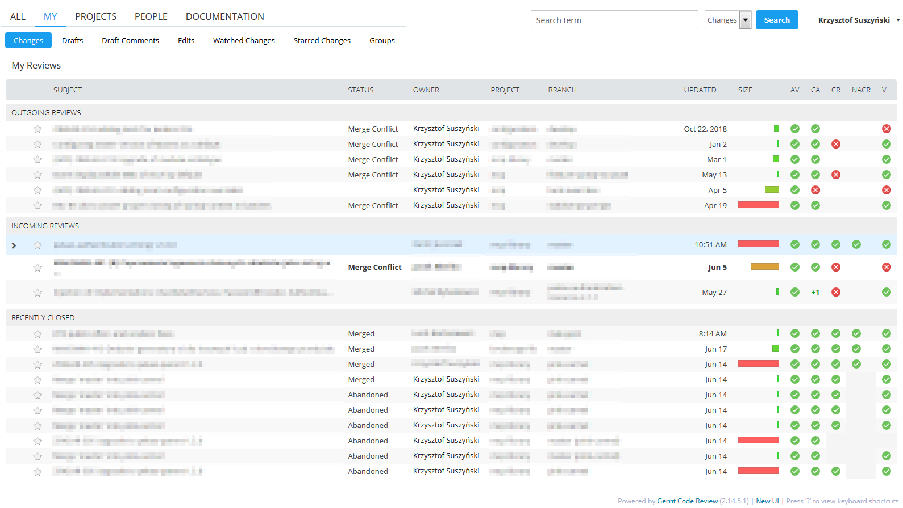
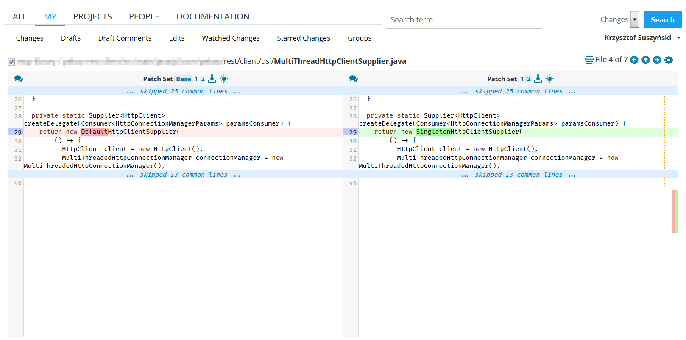
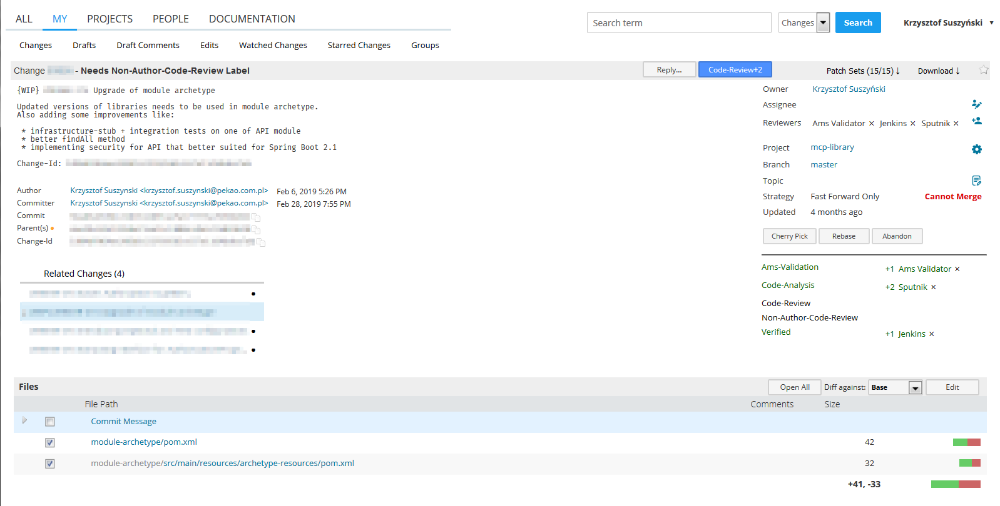

Gerrit CSS theme
======================

Clean and modern CSS theme for Gerrit that uses [Fira Code](https://github.com/tonsky/FiraCode) font.

# How to install

## Global installation

Configuration can either be sitewide or per-project.
To modify a sitewide theme, please copy `GerritSite.css` to `'$site_path'/etc`.
For per-project themes, copy it into the appropriate per-project directory `'$site_path'/themes/{project-name}`.

## Local instalation

To install theme just for you use [Stylus](https://github.com/openstyles/stylus) browser extension. It's avaiable for:

1. [Chrome](https://chrome.google.com/webstore/detail/stylus/clngdbkpkpeebahjckkjfobafhncgmne)
2. [Firefox](https://addons.mozilla.org/firefox/addon/styl-us/)
3. [Opera](https://addons.opera.com/extensions/details/stylus/)

Just add a `GerritSite.css` to your gerrit address starting with expression, for ex.: `https://gerrit-host:8443/gerrit/`

## Supported versions

The theme was designed on Gerrit `2.14.5.x` and it will work on newer version. Your updates, patches and improvements are welcome.

The theme was tested on Chrome 74 and Firefox 67.

## License

Apache 2.0
